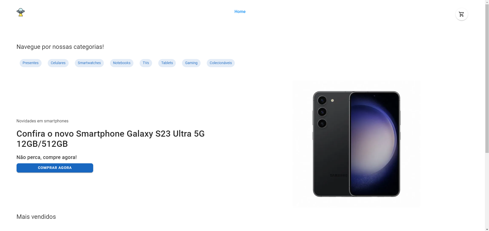
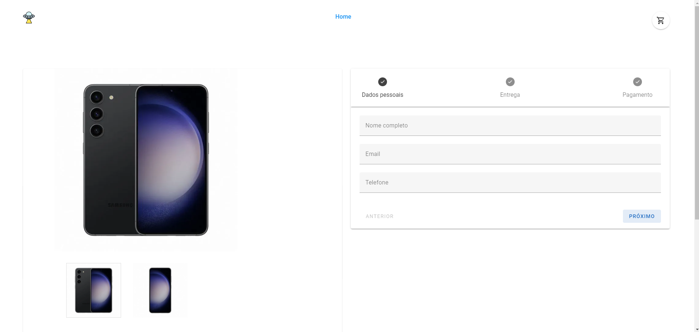

# Deep Space Store

This project consists of creating a payment page for the fictional online store "Deep Space Store". The payment page is the final point where customers can finalize their purchases, viewing a product offer and filling in their details to make payment.




## Table of contents

- [Deep Space Store](#deep-space-store)
	- [Table of contents](#table-of-contents)
	- [Features](#features)
	- [Requirements](#requirements)
	- [Installation](#installation)
	- [Usage](#usage)
		- [Starting the Development Server](#starting-the-development-server)
		- [Building for Production](#building-for-production)
		- [Running Unit and Integration tests](#running-unit-and-integration-tests)
	- [Deployment](#deployment)
	- [License](#license)

## Features

- View a product offer.
- Filling in customer data, including name, email, telephone, address and CPF.
- Providing payment method details such as credit card number, expiration date and security code.
- Validation of data provided by the customer.
- Payment processing.

## Requirements

- [Node.js](https://nodejs.org/en/) >= 20.9.0
- [pnpm](https://pnpm.js.org/) >= 8.10.2

## Installation

Set up the project using pnpm. Use the command
`pnpm install`

After completing the installation, the environment is ready for development.

## Usage

This section covers how to start the development server and build the project for production.

### Starting the Development Server

To start the development server with hot-reload, run the following command. The server will be accessible at [http://localhost:3000](http://localhost:3000):

```bash
pnpm dev
```


### Building for Production

To build the project for production, use:

```bash
pnpm build
```

Once the build process is completed, the application will be ready for deployment in a production environment.

### Running Unit and Integration tests

To run tests, run the the following command:

```bash
pnpm test
```

Unit test files are in the folder `src/tests/unit`
Integration test files are in the folder `src/tests/integration`

Coverage files will be in the folder `/coverage`

## Deployment

The project is deployed in Vercel at the link [https://deep-space-store-2-0.vercel.app/](https://deep-space-store-2-0.vercel.app/)

## License

[MIT](http://opensource.org/licenses/MIT)
